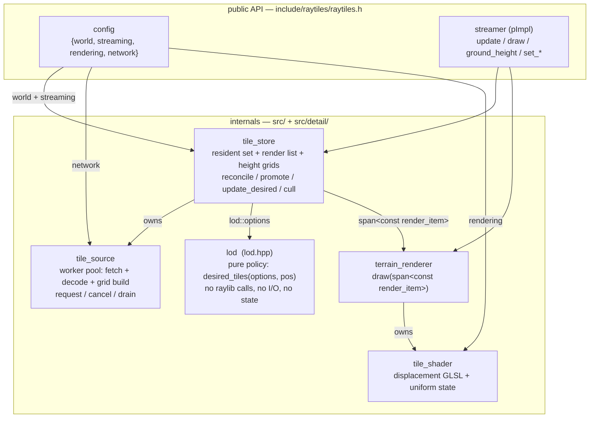
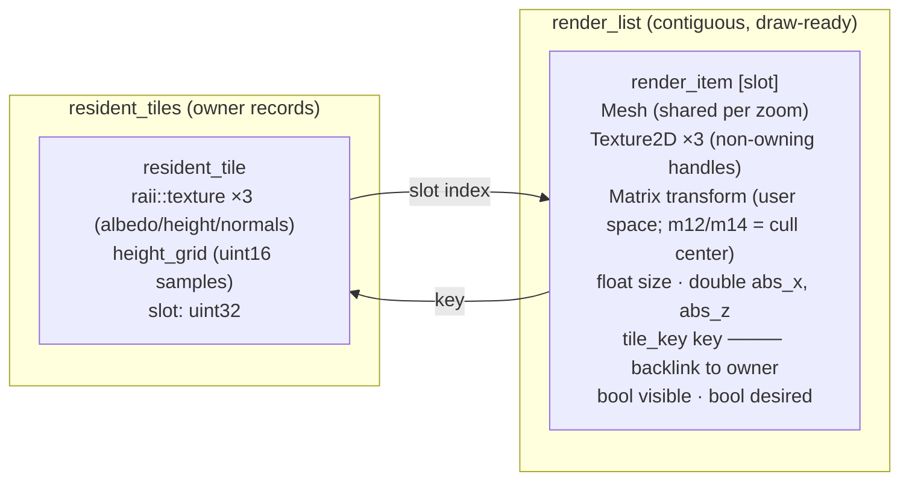
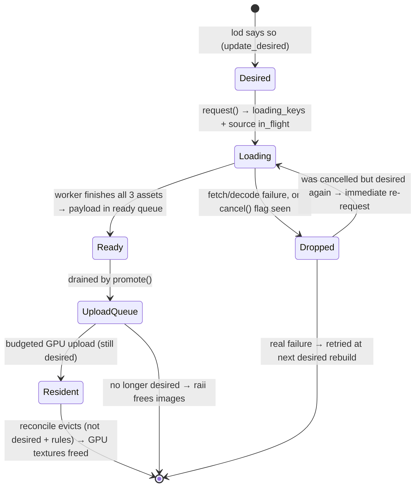
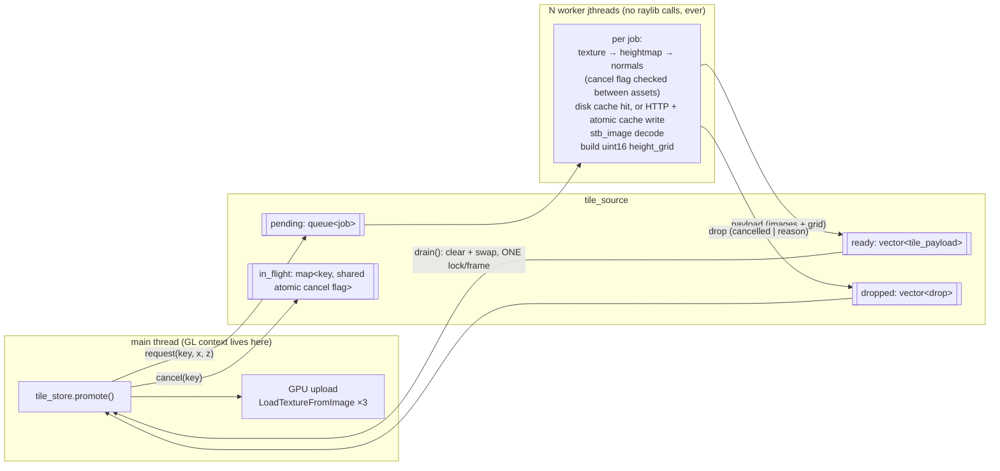

# Raytiles architecture

How the terrain module is put together after the composition refactor (branch
`refactor-composition-plan`, 2026-08). This is the *what and why* of the design; the step-by-step
history and rationale for each decision live in [`refactor-plan.md`](refactor-plan.md) and
[`refactor/`](refactor/README.md).

The sky module (`rayskies.h`) is independent of everything on this page.

---

## 1. Design principles

1. **Composition over orchestration-in-one-class.** Each concern lives in one component with one
   job: deciding *what* should be loaded (`lod`), fetching it (`tile_source`), owning it
   (`tile_store`), and drawing it (`terrain_renderer`). The public `streamer` is a thin per-frame
   conductor behind a pImpl.
2. **One render-ready data structure.** Everything the draw loop needs sits in a single contiguous
   `std::vector<render_item>` — mesh handle, textures, baked transform, cull data. Drawing is a
   linear scan with **zero lookups**; all bookkeeping happens at the (rare) moments tiles enter or
   leave residency.
3. **Move data, don't poll it.** Workers deliver *finished whole tiles* through a queue the main
   thread drains with one lock per frame. No futures, no per-frame polling, no per-frame string
   formatting.
4. **The main thread's frame budget is the scarce resource.** Anything that can be computed on a
   worker (PNG decode, height-grid build) is; anything periodic on the main thread is gated on the
   event that could change its answer (coverage GC, transform rebakes, sorting).
5. **raylib-native surface.** The public config and setters speak `Color` / `Vector3` / `Camera3D`;
   internal handles in the render list are raylib PODs, so the renderer *is* plain raylib code.

## 2. Components and their relationships



Ownership is a straight tree: `streamer::impl` owns `tile_store` and `terrain_renderer`;
`tile_store` owns its `tile_source`; `terrain_renderer` owns the `tile_shader`. `lod` is a free
function, owned by nobody — which is exactly what makes it unit-testable (equivalence, invariant,
and snapshot suites in `tests/lod_tests.cpp`).

The config sub-structs flow to the components **unchanged** — there are no internal mirror-option
structs and no field-copying translators. `tile_source` derives what it needs (URL host/path
splits, cache path templates from `cache_dir`) privately.

## 3. The central data structure: the render list

`tile_store` maintains two containers in lockstep (asserted every frame in debug builds):

```
resident_tiles : unordered_map<tile_key, resident_tile>     ← OWNERSHIP
render_list    : vector<render_item>                        ← DRAWING
```



- **Draw** = `for (item : list) if (item.visible) { bind 3 maps; DrawMesh(item.mesh, mat, item.transform); }`.
  No hashing, no pointer chasing, one branch per tile. The list is kept **front-to-back** (re-sorted
  only when membership changes) so the GPU's early-Z rejects occluded terrain fragments.
- **Membership changes are the rare event**: promote appends (`slot = size-1`), evict swap-removes
  and re-points the moved item's owner through the `key` backlink. Steady-state frames touch only
  the `visible` flags.
- **Transforms are baked, not computed per frame.** `transform` holds the user-space translation
  (`absolute + world_offset`, added in double before the float cast). It is rebaked for the whole
  list only when `world_offset` changes — i.e. on a large-world rebase, which the demo does every
  4096 m, not every frame.
- The `height_grid` deliberately lives on the *owner*, not the item: it serves `ground_height()`
  queries, not drawing.

## 4. Per-frame data flow

`streamer::update(camera, world_offset)` converts the camera to absolute space
(`abs = user − offset`) and runs four store steps in fixed order; `draw()` then consumes the list.

```mermaid
sequenceDiagram
    participant App
    participant Streamer as streamer::update
    participant Store as tile_store
    participant Lod as lod (pure)
    participant Src as tile_source
    participant Rend as terrain_renderer

    App->>Streamer: update(camera, world_offset)
    Note over Streamer: abs = camera.pos − offset<br/>cache camera + offset for draw()/ground_height()

    Streamer->>Store: reconcile(abs)
    Note over Store: evict residents that are not desired AND<br/>(base-zoom | invisible | beyond horizon |<br/>covered — checked only when coverage_dirty)

    Streamer->>Store: promote(abs, offset)
    Store->>Src: drain(ready, dropped)   [one lock: swap]
    Note over Store: drops → clear loading key; log real failures;<br/>re-request cancelled-but-desired-again keys<br/>payloads → upload_queue
    Note over Store: budgeted upload loop (wall-clock + count caps):<br/>skip undesired, LoadTexture ×3, mipmaps,<br/>append render_item + resident_tile<br/>then: front-to-back sort iff membership changed

    alt moved > update_distance
        Streamer->>Store: update_desired(abs)
        Store->>Lod: desired_tiles(options, abs)
        Lod-->>Store: vector&lt;tile_key&gt;
        Note over Store: refresh item.desired flags<br/>cancel loading keys ∉ desired (once, here)
        Store->>Src: request({key, abs provider x/z}) for missing keys
    end

    Streamer->>Store: cull(frustum, offset)
    Note over Store: offset changed? rebake all transforms<br/>then visible = frustum test per item (in place)

    App->>Streamer: draw()
    Streamer->>Rend: draw(camera.pos, store.render_items())
    Note over Rend: linear scan; bind item textures;<br/>DrawMesh(item.mesh, material, item.transform)
```

Why this order: `reconcile` runs against *last frame's* visibility flags (cheap, already computed);
`promote` runs before `update_desired` so freshly drained drops are visible to the re-request
logic; `cull` runs last so this frame's frustum classifies everything — including tiles promoted
this very frame.

Four gates keep steady-state frames near-free:

| Work | Runs when | Guarded by |
|---|---|---|
| Desired-set rebuild + cancels + requests | camera moved > `update_distance` (500 m default) | distance check in `streamer::update` |
| Coverage (`is_tile_covered`) evictions | something was promoted or the desired set changed | `coverage_dirty` — exact, not heuristic: evictions only *remove* cover, which can only flip the answer toward "keep" |
| Front-to-back sort + slot rebuild | membership changed | `order_dirty` |
| Transform rebake (whole list) | `world_offset` changed (rebase) | exact float compare vs `baked_offset` |

## 5. Tile lifecycle

A tile is keyed by `tile_key {zoom, x, z}` (anchor-relative; SplitMix64-finalized hash). The
absolute provider coordinates travel inside the `tile_request` — the source knows nothing about
world anchoring, and dedup/cancel are keyed by `tile_key` end-to-end.



Notes on the two asymmetric retry paths: a **cancelled** tile that became desired again before its
drop was collected is re-requested immediately (the camera came back); a **failed** tile waits for
the next desired-set rebuild so a broken server isn't hammered every frame.

## 6. Threading model



The rules that keep this safe (all load-bearing, see `tile_source.h` doc comments):

- **Workers never call any raylib function** — not even `UnloadImage`. Decode is stb_image directly
  (raylib's loaders route through non-thread-safe globals); failure-path pixel buffers are freed
  with `stbi_image_free`. `raii::image` payload members are only ever *destroyed* on the main
  thread (drain or `~tile_source`).
- One mutex guards the four containers. Per-frame main-thread cost is exactly one uncontended lock
  (the drain swap); the reused out-vectors make steady-state drains allocation-free.
- Dedup: `request` is a no-op while the key is in `in_flight` (pending *or* executing *or*
  cancelled-but-uncollected). Every requested key is answered exactly once — payload or drop —
  which is what lets `tile_store.loading_keys` be a plain set instead of futures.
- Shutdown uses `jthread` stop tokens with `condition_variable_any` (a plain `condition_variable`
  cannot observe the stop request and would hang the destructor). An in-flight HTTP fetch cannot
  be aborted; destruction may wait out a network timeout.
- Keep-alive `httplib::Client`s are per-worker (no sharing, no locking) and live across jobs.

## 7. Height queries

`ground_height(position)` is a CPU-side query, decoupled from rendering:

- Each resident tile keeps a `height_grid`: `uint16` per texel, encoded `round(height_m) + 32768`
  (integer-meter resolution — the Terrarium source is only meter-accurate; 128 KB per 256×256 tile
  vs 192–256 KB for the decoded image it replaced). Built on the worker, right after the heightmap
  decode.
- The query walks zooms max → base, picks the finest resident tile containing the XZ point, and
  samples the grid **bilinearly** (texel centers at `(i+0.5)/n`, edges clamped). O(1); no raylib.
- The GPU path is independent: the vertex shader samples the full-precision Terrarium RGB texture
  and decodes it per vertex, so visuals never see the grid quantization.

## 8. Coordinate spaces

Two frames, one convention: **`absolute = user − world_offset`**.

| | user space | absolute space |
|---|---|---|
| Who lives here | the app's camera, models, frustum | tile keys/centers, lod policy, store state |
| Why | keeps floats small near the camera (raylib's pipeline is float-only) | tile math needs a fixed origin |
| Where they meet | `render_item.transform` — baked from `abs + offset` in **double**, cast to float once | `streamer::update` converts the camera once per frame |

The app owns rebasing (see `sandbox/demo.cpp`): when the camera drifts past a threshold it shifts
camera *and* `world_offset` by the same amount. The store notices the offset change in `cull` and
rebakes every transform — the double-precision add happens before the float cast, so far-from-anchor
worlds don't wobble.

## 9. Configuration surface (public API v2)

```
raytiles::config
├── world      anchor tile, base/max zoom, tile_size, skirt_overlap[7], mipmaps, origin_offset
├── streaming  radius, thresholds[7], update_distance, upload budget/cap, near/far planes
├── rendering  fog start/end/color, ambient, sun, height/normals scale, skirt_drop   (all runtime-mutable)
└── network    threads, timeouts, cache_dir, provider URL templates (:zoom:/:x:/:y:)
```

- `streamer(config)` or `streamer(lat, lon, config)` — the geo constructor derives anchor tile,
  tile size, and origin offset from the coordinate.
- Runtime changes go through `set_rendering(rendering_config)` (bulk) or the per-parameter setters
  (`set_fog_color(Color)`, `set_sun_direction(Vector3)`, …) — raylib types only, one overload each.
- The C wrapper (`craytiles.h`) mirrors this 1:1: `RaytilesConfig` (same nesting, C arrays and
  `const char*`), `RaytilesConfigDefault()`, opaque `RaytilesStreamer*`.

## 10. Where things live

| Concern | Public header | Detail header | Implementation |
|---|---|---|---|
| API, config | `raytiles.h`, `craytiles.h` | — | `raytiles.cpp`, `craytiles.cpp` |
| LOD policy | — | `lod.hpp` (header-only) | — |
| Tile data types (`tile_key`, `render_item`, `resident_tile`, `height_grid`) | — | `tile.hpp` | — |
| Resident set / render list | — | `tile_store.h` | `tile_store.cpp` |
| Fetching | — | `tile_source.h` | `tile_source.cpp` (only place httplib may appear) |
| Drawing | — | `terrain_renderer.h`, `tile_shader.h` | `terrain_renderer.cpp`, `tile_shader.cpp` |
| Math / frustum / grids | — | `utils.hpp` (also `Plane`/`Frustum`) | — |
| RAII wrappers | — | `raii.hpp` | — |

The streamer is pImpl'd, so consumer translation units see none of the detail headers — and
therefore none of httplib, the containers, or `Plane`/`Frustum`.
